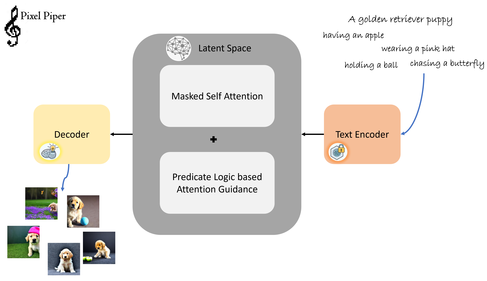
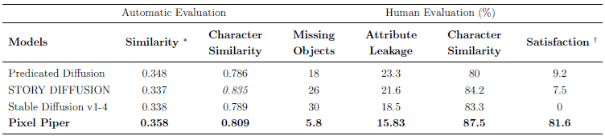

# The Pixel Piper: Guiding Diffusion Models with Attention-Based Predicate Logic for Feature Consistent Text-to-Image Generation

Diffusion Models have revolutionized Text-to-Image generation, yet ensuring accurate semantic representation and character consistency remains a significant challenge. In order to overcome the difficulties in capturing fine-grained textual nuances and preserving feature fidelity across generated images, this research presents a unique framework Pixel Piper, that improves diffusion models by combining Predicate Logic with Attention processes. We leverage predicate logic to represent user intentions as formal propositions, offering a structured approach to semantic guidance. In order to ensure that generated visuals accurately reflect the original text, we treat attention mappings as fuzzy predicates and create a differentiable loss function that guides the diffusion process towards achieving these propositions. 
Additionally, we suggest an improved attention module that emphasizes preserving feature consistency throughout the generation process, motivated by the idea of consistent masked self-attention. This module dynamically adjusts the weights of attention in accordance with logical predicates such that prominent features are preserved across multiple denoising steps. This integration aims at solving issues like lost object relations and volatile feature representations, typical in existing methods. By combining the semantic expressiveness of predicate logic and the feature-preservation capability of boosted attention, our approach, known as Pixel Piper: Guiding Diffusion Models with Attention-Based Predicate Logic, improves the alignment between text descriptions and synthesized images. We demonstrate that Pixel Piper makes diffusion models significantly improved at generating images with improved semantic accuracy and character consistency, as validated by qualitative and quantitative evaluation. This approach sets a new state-of-the-art in text-to-image synthesis by providing a robust framework to generate feature-consistent images

    

    Fig. 1 Overview of Pixel Piper to generating feature consistent images.

 

# Results

    

    Fig. 2 Similarity Comparisons of generated images.

 

Pixel Piper performed better in text-to-image similarity compared to baseline models. While STORY DIFFUSION was more character similar, the aggregate measure of text-to-image and character similarity indicated that Pixel Piper had a better-balanced and ultimately more effective representation of the intended textual and character- specific information. With Human Evaluation it shows that Pixel Piper is SOTA.

<i>∗ marks the Text-to-Image Similarity. † marks the percentage of most convincing images.</i>
